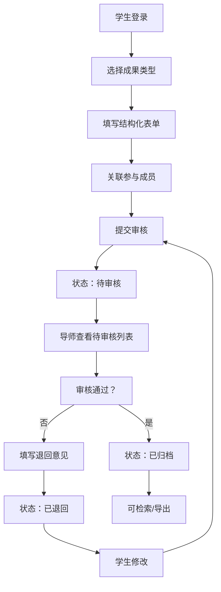
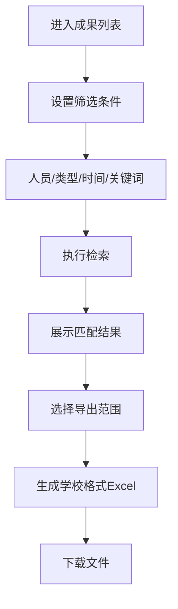

## 1. 产品概述

实验室师生成果管理平台是一套面向高校科研团队的数字化管理系统，旨在解决实验室科研成果分散、统计困难、审核流程不规范等痛点问题。系统通过角色权限隔离、结构化录入、审批流程、多维度检索和智能统计分析，实现科研成果的全生命周期管理。

平台的核心价值在于：规范科研成果管理流程，减轻导师行政负担，提升成果统计效率，为实验室考核、职称评定、项目申报提供准确的数据支撑。

## 2. 核心功能

### 2.1 用户角色

| 角色 | 注册方式 | 核心权限 |
|------|----------|----------|
| 导师/管理员 | 管理员创建账号 | 成果审核、用户管理、数据统计、成果导出、全量数据查看 |
| 学生 | 管理员创建账号或自行注册 | 成果录入、修改个人成果、查看审核状态、检索已归档成果 |

### 2.2 功能模块

1. **登录与权限控制**：角色身份认证、权限路由拦截、会话管理
2. **成果管理**：论文/专利/项目的结构化录入、编辑、删除、提交审核
3. **审批流程**：导师审核、通过/退回、审核意见反馈、状态跟踪
4. **多维度检索**：按人员、成果类型、时间范围、关键词等组合检索
5. **统计分析**：按年度/成员生成统计图表、数据可视化展示
6. **成果导出**：一键导出符合学校考核格式的Excel清单

### 2.3 页面详情

| 页面名称 | 模块名称 | 功能描述 |
|---------|----------|----------|
| 登录页 | 身份认证 | 账号密码登录、角色选择、记住登录状态 |
| 首页/仪表盘 | 数据概览 | 成果总数统计、待审核数量、年度趋势图表、快捷操作入口 |
| 成果列表页 | 成果检索 | 多条件筛选、列表展示、分页、排序、批量操作 |
| 成果录入页 | 成果录入 | 表单录入（论文/专利/项目三类）、成员关联、文件上传 |
| 成果详情页 | 成果查看 | 完整信息展示、审核历史、操作记录 |
| 审核管理页 | 审批流程 | 待审核列表、审核操作（通过/退回）、填写审核意见 |
| 统计分析页 | 数据统计 | 年度统计图表、成员贡献排行、成果类型分布、趋势分析 |
| 用户管理页 | 用户管理 | 用户列表、添加/编辑用户、角色分配、账号状态管理 |

## 3. 核心流程

### 3.1 成果录入与审批流程

学生登录系统后，选择成果类型（论文/专利/项目），填写结构化表单并关联参与成员，提交后进入待审核状态。导师登录后查看待审核成果，可查看详情并填写审核意见，选择通过或退回。通过的成果自动归档并可被检索查看；退回的成果返回给学生修改后可重新提交。

### 3.2 检索与导出流程

用户进入成果列表页，通过筛选条件（人员、类型、时间、关键词）组合检索，系统实时返回匹配结果。用户可选择导出全部或部分成果，系统自动生成符合学校考核格式的Excel文件供下载。

## 4. 用户界面设计

### 4.1 设计风格

- **主色调**：学术蓝 (#1e40af) 作为主色，代表专业与严谨；科技青 (#0ea5e9) 作为辅助色，体现创新活力
- **中性色**：以 slate 色系为基础，从 slate-50 到 slate-900 构建完整的灰度层次
- **按钮风格**：圆角 8px，悬浮时有轻微阴影加深和色彩饱和度提升，点击有微缩反馈
- **字体**：标题使用 Noto Serif SC（学术感衬线字体），正文使用 Noto Sans SC（清晰易读的无衬线字体）
- **布局风格**：顶部导航 + 左侧侧边栏的经典管理后台布局，内容区采用卡片式设计，信息层次分明
- **图标风格**：使用 lucide-react 线性图标，保持简洁统一，关键操作使用带颜色的图标增强识别度

### 4.2 页面设计概述

| 页面名称 | 模块名称 | UI 元素 |
|---------|----------|--------|
| 登录页 | 登录表单 | 居中卡片布局，学院Logo展示，渐变背景，平滑入场动画 |
| 首页 | 数据概览 | 统计卡片网格（带图标和同比数据）、年度趋势折线图、待办事项列表、快捷操作按钮组 |
| 成果列表 | 检索与展示 | 顶部筛选栏（多条件组合）、数据表格、分页控件、批量操作工具栏 |
| 成果录入 | 表单设计 | 分步表单（基本信息→成员→附件→提交），表单项分组，实时校验，保存草稿功能 |
| 审核管理 | 审批操作 | 待审核卡片列表，侧边滑出详情面板，审核操作按钮组（通过/退回），意见输入框 |
| 统计分析 | 数据可视化 | 标签页切换（年度/成员/类型）、多种图表组合（柱状图+饼图+折线图）、数据导出按钮 |
| 用户管理 | 用户列表 | 搜索框、用户表格、角色标签、状态开关、操作下拉菜单 |

### 4.3 响应式设计

- **设计策略**：桌面端优先（1440px基准），适配平板（768px）和移动端（375px）
- **断点设计**：lg ≥ 1024px（完整布局），md ≥ 768px（侧边栏可收起），sm < 768px（顶部导航+抽屉菜单）
- **触摸优化**：移动端按钮最小高度 44px，表单控件间距 8px，表格支持横向滚动

### 4.4 动效与交互

- **页面加载**：顶部进度条 + 内容区淡入（staggered 动画，延迟 50ms 递增）
- **按钮交互**：hover 时背景色加深 + 轻微上浮，click 时缩放 0.97
- **面板切换**：侧边滑出动画（translateX + 透明度过渡 300ms）
- **数据加载**：表格使用骨架屏占位，图表使用脉冲动画
- **表单验证**：失焦时即时校验，错误信息红色提示，成功后绿色勾选
