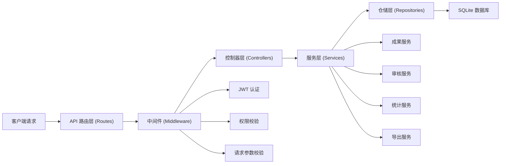
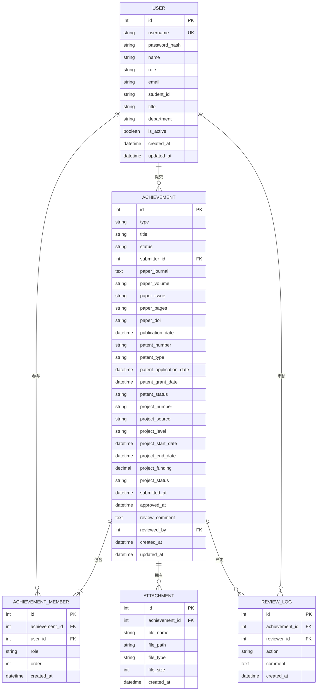

## 1. 架构设计

本系统采用前后端分离的全栈架构，前端使用 React + TypeScript 构建 SPA 单页应用，后端使用 Express + TypeScript 提供 RESTful API 服务，数据库采用 SQLite 存储关系型数据。整体架构分层清晰，职责明确，便于维护和扩展。


## 2. 技术选型说明

- **前端框架**：React@18 + TypeScript
  - 采用函数式组件 + Hooks 开发模式，提升代码复用性和可维护性
  - TypeScript 提供类型安全，减少运行时错误
- **构建工具**：Vite@5
  - 开发环境启动快，HMR 热更新响应及时
  - 生产环境构建优化，打包体积小
- **样式方案**：Tailwind CSS@3
  - 原子化 CSS，快速构建 UI
  - 统一设计 token，保持视觉一致性
- **状态管理**：Zustand
  - 轻量级状态管理，API 简洁易用
  - 支持中间件扩展，可持久化存储
- **UI 组件**：Lucide React（图标）+ 自研业务组件
  - 避免引入重型 UI 库，减小打包体积
  - 自定义组件更贴合业务需求
- **图表库**：Recharts
  - 基于 React 的图表组件库，API 友好
  - 支持柱状图、折线图、饼图等多种图表类型
- **后端框架**：Express@4 + TypeScript
  - 轻量级 Node.js Web 框架，灵活可扩展
  - TypeScript 提供类型安全
- **数据库**：SQLite3 + TypeORM
  - 轻量级关系型数据库，无需额外安装服务
  - TypeORM 提供 ORM 映射，简化数据库操作
- **认证方案**：JWT (jsonwebtoken)
  - 无状态认证，便于水平扩展
  - Token 存储在 localStorage，前端自主管理
- **Excel 导出**：xlsx (SheetJS)
  - 功能强大的 Excel 处理库
  - 支持多种格式导入导出

## 3. 路由定义

| 路由路径 | 页面组件 | 权限要求 | 功能说明 |
|---------|----------|----------|----------|
| `/login` | Login | 公开 | 用户登录页面 |
| `/` | Dashboard | 已登录 | 首页数据概览 |
| `/achievements` | AchievementList | 已登录 | 成果列表与检索 |
| `/achievements/new` | AchievementCreate | 学生/导师 | 新增成果录入 |
| `/achievements/:id` | AchievementDetail | 已登录 | 成果详情查看 |
| `/achievements/:id/edit` | AchievementEdit | 创建者/导师 | 编辑成果信息 |
| `/review` | ReviewList | 导师/管理员 | 审核管理页面 |
| `/statistics` | Statistics | 已登录 | 统计分析页面 |
| `/users` | UserManagement | 导师/管理员 | 用户管理页面 |
| `*` | NotFound | 公开 | 404 页面 |

## 4. API 接口定义

### 4.1 认证相关

```typescript
// 登录请求
interface LoginRequest {
  username: string;
  password: string;
}

// 登录响应
interface LoginResponse {
  token: string;
  user: {
    id: number;
    username: string;
    name: string;
    role: 'student' | 'advisor' | 'admin';
    email: string;
  };
}

// GET /api/auth/me - 获取当前用户信息
// POST /api/auth/login - 用户登录
// POST /api/auth/logout - 用户登出
```

### 4.2 用户管理

```typescript
// 用户信息
interface User {
  id: number;
  username: string;
  name: string;
  role: 'student' | 'advisor' | 'admin';
  email: string;
  studentId?: string;
  title?: string;
  department: string;
  createdAt: string;
  isActive: boolean;
}

// GET /api/users - 获取用户列表
// GET /api/users/:id - 获取用户详情
// POST /api/users - 创建用户
// PUT /api/users/:id - 更新用户
// DELETE /api/users/:id - 删除用户
// GET /api/users/active - 获取活跃用户列表（用于成果关联）
```

### 4.3 成果管理

```typescript
type AchievementType = 'paper' | 'patent' | 'project';
type AchievementStatus = 'draft' | 'pending' | 'approved' | 'rejected';

// 成果成员
interface AchievementMember {
  id: number;
  userId: number;
  userName: string;
  role: 'first_author' | 'corresponding_author' | 'co_author' | 'principal' | 'participant';
  order: number;
}

// 成果基本信息
interface Achievement {
  id: number;
  type: AchievementType;
  title: string;
  status: AchievementStatus;
  submitterId: number;
  submitterName: string;
  members: AchievementMember[];
  createdAt: string;
  submittedAt?: string;
  approvedAt?: string;
  reviewComment?: string;
  reviewedBy?: number;
  reviewedByName?: string;

  // 论文字段
  paperJournal?: string;
  paperVolume?: string;
  paperIssue?: string;
  paperPages?: string;
  paperDoi?: string;
  paperCitation?: string;
  publicationDate?: string;

  // 专利字段
  patentNumber?: string;
  patentType?: 'invention' | 'utility' | 'design';
  patentApplicationDate?: string;
  patentGrantDate?: string;
  patentStatus?: 'applied' | 'granted';

  // 项目字段
  projectNumber?: string;
  projectSource?: string;
  projectLevel?: 'national' | 'provincial' | 'city' | 'school' | 'enterprise';
  projectStartDate?: string;
  projectEndDate?: string;
  projectFunding?: number;
  projectStatus?: 'ongoing' | 'completed';

  attachments?: Attachment[];
}

// GET /api/achievements - 获取成果列表（支持筛选）
// GET /api/achievements/:id - 获取成果详情
// POST /api/achievements - 创建成果
// PUT /api/achievements/:id - 更新成果
// DELETE /api/achievements/:id - 删除成果
// POST /api/achievements/:id/submit - 提交审核
```

### 4.4 审核管理

```typescript
interface ReviewRequest {
  status: 'approved' | 'rejected';
  comment: string;
}

// GET /api/reviews/pending - 获取待审核列表
// POST /api/reviews/:id - 审核成果
// GET /api/reviews/history - 获取审核历史
```

### 4.5 统计与导出

```typescript
interface StatisticsQuery {
  startYear?: number;
  endYear?: number;
  userId?: number;
  type?: AchievementType;
}

interface YearlyStatistics {
  year: number;
  paperCount: number;
  patentCount: number;
  projectCount: number;
  totalCount: number;
}

interface MemberStatistics {
  userId: number;
  userName: string;
  paperCount: number;
  patentCount: number;
  projectCount: number;
  totalCount: number;
}

// GET /api/statistics/yearly - 按年度统计
// GET /api/statistics/members - 按成员统计
// GET /api/statistics/types - 按类型统计
// GET /api/export/excel - 导出Excel
```

## 5. 后端服务架构

后端采用经典的三层架构（Controller → Service → Repository），各层职责清晰，便于单元测试和维护。



### 目录结构

```
api/
├── src/
│   ├── config/              # 配置文件
│   │   ├── database.ts      # 数据库配置
│   │   └── jwt.ts           # JWT配置
│   ├── middleware/          # 中间件
│   │   ├── auth.ts          # 认证中间件
│   │   └── permission.ts    # 权限中间件
│   ├── controllers/         # 控制器
│   │   ├── auth.controller.ts
│   │   ├── user.controller.ts
│   │   ├── achievement.controller.ts
│   │   ├── review.controller.ts
│   │   └── statistics.controller.ts
│   ├── services/            # 服务层
│   │   ├── auth.service.ts
│   │   ├── user.service.ts
│   │   ├── achievement.service.ts
│   │   ├── review.service.ts
│   │   ├── statistics.service.ts
│   │   └── export.service.ts
│   ├── repositories/        # 仓储层
│   │   ├── base.repository.ts
│   │   ├── user.repository.ts
│   │   ├── achievement.repository.ts
│   │   └── review.repository.ts
│   ├── entities/            # 数据库实体
│   │   ├── User.ts
│   │   ├── Achievement.ts
│   │   ├── AchievementMember.ts
│   │   ├── Attachment.ts
│   │   └── ReviewLog.ts
│   ├── routes/              # 路由定义
│   ├── utils/               # 工具函数
│   └── index.ts             # 应用入口
├── uploads/                 # 上传文件目录
└── data/                    # 数据库文件目录
```

## 6. 数据模型设计

### 6.1 ER 关系图



### 6.2 数据库初始化脚本 (DDL)

```sql
-- 用户表
CREATE TABLE IF NOT EXISTS user (
  id INTEGER PRIMARY KEY AUTOINCREMENT,
  username VARCHAR(50) UNIQUE NOT NULL,
  password_hash VARCHAR(255) NOT NULL,
  name VARCHAR(100) NOT NULL,
  role VARCHAR(20) NOT NULL CHECK (role IN ('student', 'advisor', 'admin')),
  email VARCHAR(100),
  student_id VARCHAR(50),
  title VARCHAR(50),
  department VARCHAR(100),
  is_active BOOLEAN DEFAULT 1,
  created_at DATETIME DEFAULT CURRENT_TIMESTAMP,
  updated_at DATETIME DEFAULT CURRENT_TIMESTAMP
);

-- 成果表
CREATE TABLE IF NOT EXISTS achievement (
  id INTEGER PRIMARY KEY AUTOINCREMENT,
  type VARCHAR(20) NOT NULL CHECK (type IN ('paper', 'patent', 'project')),
  title VARCHAR(500) NOT NULL,
  status VARCHAR(20) NOT NULL DEFAULT 'draft' CHECK (status IN ('draft', 'pending', 'approved', 'rejected')),
  submitter_id INTEGER NOT NULL,
  -- 论文字段
  paper_journal VARCHAR(200),
  paper_volume VARCHAR(50),
  paper_issue VARCHAR(50),
  paper_pages VARCHAR(50),
  paper_doi VARCHAR(200),
  paper_citation VARCHAR(500),
  publication_date DATE,
  -- 专利字段
  patent_number VARCHAR(100),
  patent_type VARCHAR(20) CHECK (patent_type IN ('invention', 'utility', 'design')),
  patent_application_date DATE,
  patent_grant_date DATE,
  patent_status VARCHAR(20) CHECK (patent_status IN ('applied', 'granted')),
  -- 项目字段
  project_number VARCHAR(100),
  project_source VARCHAR(200),
  project_level VARCHAR(20) CHECK (project_level IN ('national', 'provincial', 'city', 'school', 'enterprise')),
  project_start_date DATE,
  project_end_date DATE,
  project_funding DECIMAL(12,2),
  project_status VARCHAR(20) CHECK (project_status IN ('ongoing', 'completed')),
  -- 审核字段
  submitted_at DATETIME,
  approved_at DATETIME,
  review_comment TEXT,
  reviewed_by INTEGER,
  created_at DATETIME DEFAULT CURRENT_TIMESTAMP,
  updated_at DATETIME DEFAULT CURRENT_TIMESTAMP,
  FOREIGN KEY (submitter_id) REFERENCES user(id),
  FOREIGN KEY (reviewed_by) REFERENCES user(id)
);

-- 成果成员表
CREATE TABLE IF NOT EXISTS achievement_member (
  id INTEGER PRIMARY KEY AUTOINCREMENT,
  achievement_id INTEGER NOT NULL,
  user_id INTEGER NOT NULL,
  role VARCHAR(30) NOT NULL CHECK (role IN ('first_author', 'corresponding_author', 'co_author', 'principal', 'participant')),
  order_num INTEGER NOT NULL DEFAULT 0,
  created_at DATETIME DEFAULT CURRENT_TIMESTAMP,
  FOREIGN KEY (achievement_id) REFERENCES achievement(id) ON DELETE CASCADE,
  FOREIGN KEY (user_id) REFERENCES user(id)
);

-- 附件表
CREATE TABLE IF NOT EXISTS attachment (
  id INTEGER PRIMARY KEY AUTOINCREMENT,
  achievement_id INTEGER NOT NULL,
  file_name VARCHAR(255) NOT NULL,
  file_path VARCHAR(500) NOT NULL,
  file_type VARCHAR(100),
  file_size INTEGER,
  created_at DATETIME DEFAULT CURRENT_TIMESTAMP,
  FOREIGN KEY (achievement_id) REFERENCES achievement(id) ON DELETE CASCADE
);

-- 审核日志表
CREATE TABLE IF NOT EXISTS review_log (
  id INTEGER PRIMARY KEY AUTOINCREMENT,
  achievement_id INTEGER NOT NULL,
  reviewer_id INTEGER NOT NULL,
  action VARCHAR(20) NOT NULL CHECK (action IN ('submitted', 'approved', 'rejected')),
  comment TEXT,
  created_at DATETIME DEFAULT CURRENT_TIMESTAMP,
  FOREIGN KEY (achievement_id) REFERENCES achievement(id) ON DELETE CASCADE,
  FOREIGN KEY (reviewer_id) REFERENCES user(id)
);

-- 创建索引
CREATE INDEX IF NOT EXISTS idx_achievement_type ON achievement(type);
CREATE INDEX IF NOT EXISTS idx_achievement_status ON achievement(status);
CREATE INDEX IF NOT EXISTS idx_achievement_submitter ON achievement(submitter_id);
CREATE INDEX IF NOT EXISTS idx_achievement_publication_date ON achievement(publication_date);
CREATE INDEX IF NOT EXISTS idx_achievement_member_user ON achievement_member(user_id);
CREATE INDEX IF NOT EXISTS idx_review_log_achievement ON review_log(achievement_id);

-- 插入初始管理员账号 (密码: admin123)
INSERT OR IGNORE INTO user (username, password_hash, name, role, email, department, is_active) 
VALUES ('admin', '$2b$10$N9qo8uLOickgx2ZMRZoMyeIjZAgcfl7p92ldGxad68LJZdL17lhWy', '系统管理员', 'admin', 'admin@lab.edu.cn', '计算机学院', 1);

-- 插入测试导师账号 (密码: advisor123)
INSERT OR IGNORE INTO user (username, password_hash, name, role, email, title, department, is_active) 
VALUES ('advisor', '$2b$10$N9qo8uLOickgx2ZMRZoMyeIjZAgcfl7p92ldGxad68LJZdL17lhWy', '张教授', 'advisor', 'zhang@lab.edu.cn', '教授', '计算机学院', 1);

-- 插入测试学生账号 (密码: student123)
INSERT OR IGNORE INTO user (username, password_hash, name, role, email, student_id, department, is_active) 
VALUES ('student', '$2b$10$N9qo8uLOickgx2ZMRZoMyeIjZAgcfl7p92ldGxad68LJZdL17lhWy', '李同学', 'student', 'li@lab.edu.cn', '2024001', '计算机学院', 1);
```
